## **Introduction**

There are 3 different ways to configure and interact with a FlexAnalog FPAA:

- Using the serial port under the AD2 software
- Using state-driven method (dynamic configuration)
- **Using algorithmic method (dynamic configuration)**

!!! Note
	This application note shows how to use the **algorithm method** using the AD2 software and your own microcontroller.

## **Algorithm Configuration Flow**

AD2 can generate API C code files, which form the basis of the algorithm method for dynamically reconfiguring the FPAA. Rather than sending a full configuration each time, the algorithm method computes only the minimal data needed to update specific circuit parameters on the fly and transfers it to the chip — all without interrupting its current operation. This makes reconfigurations fast and efficient. However, this method only allows you to change circuit component parameters; it does not support adding, removing, or rewiring components. If you need to switch between entirely different circuit configurations, see the [state-driven method](1_AD2_State_Driven.html#state-driven-configuration-flow). 

AD2 always generates four files regardless of the circuit complexity: two CAM C Code files, which contain the functions for manipulating circuit parameters, and two API C Code files, which contain all the configuration data and API functions needed to communicate with the FPAA.

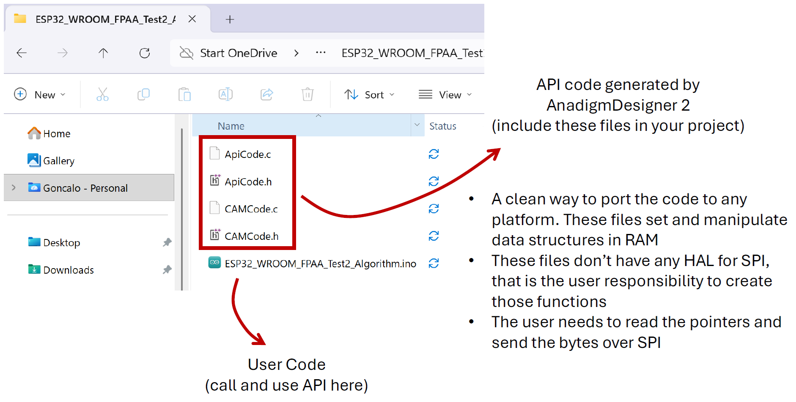

!!! note
	You are responsible for reading the pointers and sending the bytes over SPI — the API has no hardware abstraction layer (HAL) and only handles data building, which makes it straightforward to use with any microcontroller and IDE.

!!! note
	The following steps apply regardless of which microcontroller you are using to program the FPAA.

Let's walk through an example by designing a simple FPAA circuit — a low-pass filter with a dynamically adjustable cut-off frequency.

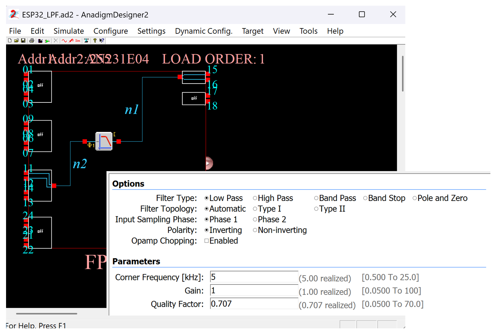

- Go to "Dynamic Config." and select "Algorithm Method"

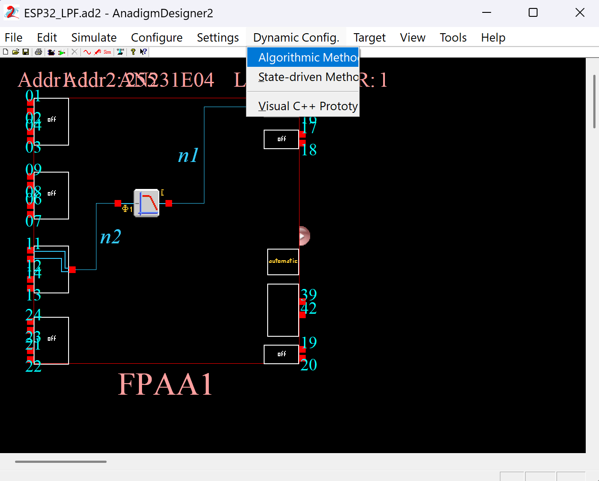

- You can adjust the generation settings by clicking "Generation Options...", but for this example we will leave the defaults as they are.

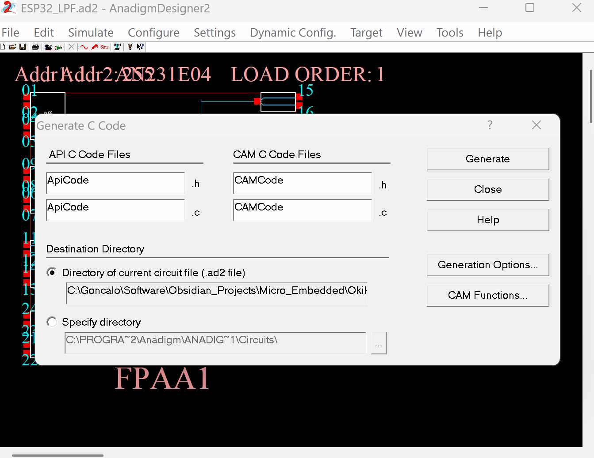

- You can also select which CAM functions to include in the API C Code files by clicking the "CAM Functions..." button.

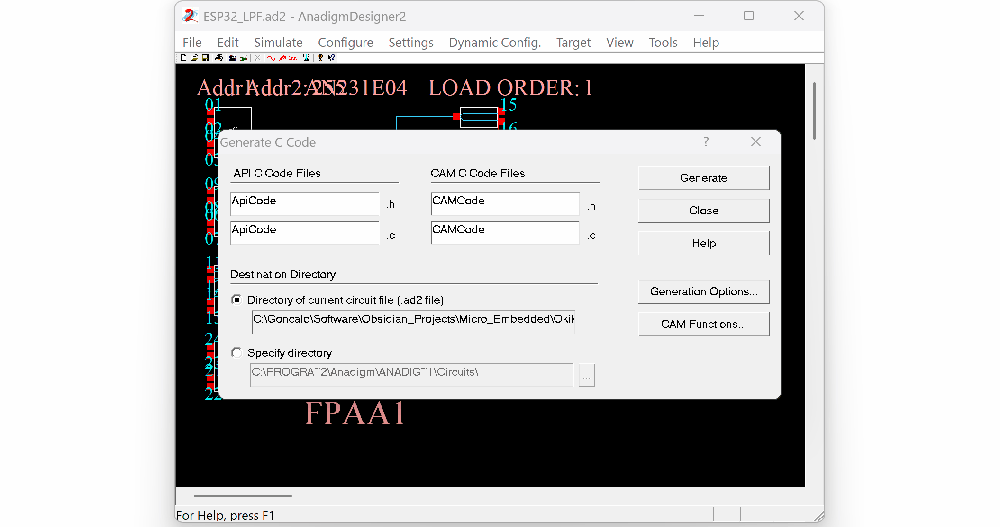

- Click "Generate" to create the four files in the selected destination directory.

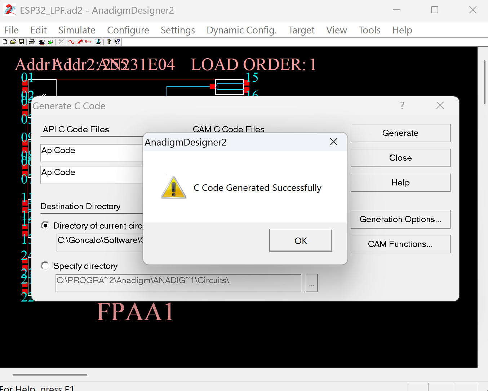

### ESP32 Example

As an example, I am going to use an ESP32 board to configure the FPAA using this algorithm method. The ESP32 is connected to the SPI pins of a Single Apex board. Analog discovery 2 is used as the oscilloscope and function generator to evaluate the AD2 design. I am also connecting a potentiometer to ESP32 analog pin A0. The goal is to read the potentiometer and control the cut-off frequency of the FPAA LPF dynamically.

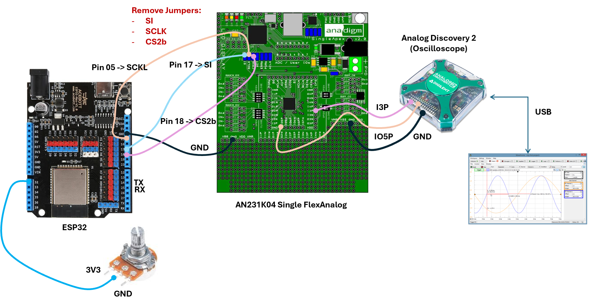

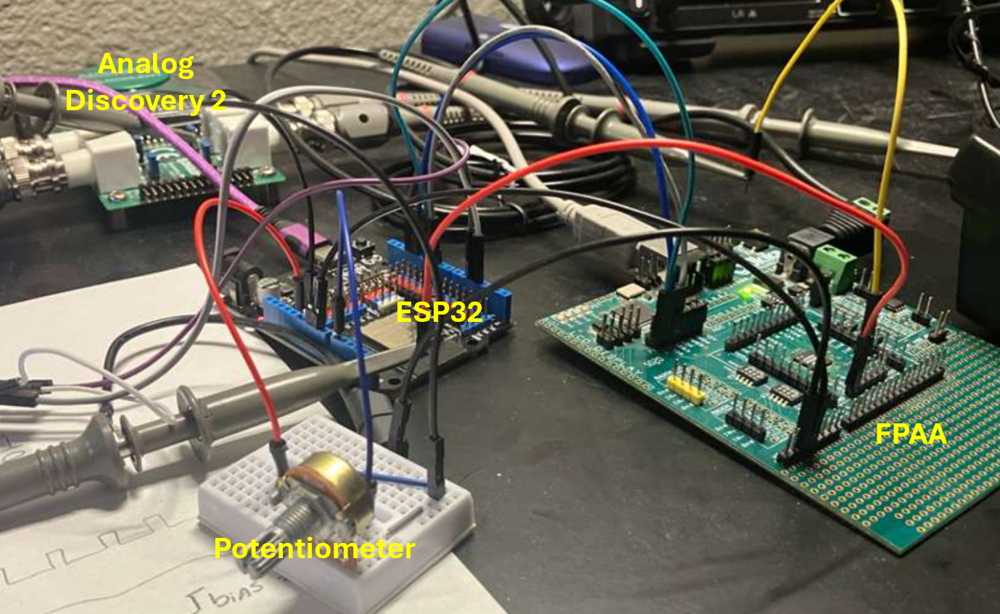

### **API C Code Integration**

- Copy the four files generated by the AD2 software into your project.

!!! note
	The generated files require no modification — the API code is simply a set of functions that manipulate data structures in RAM, with no SPI hardware abstraction layer included. You just read from the pointers and send the bytes over SPI yourself, making it easy to port to any platform.

- Let's continue the ESP32 example to see how the API functions are called.
- Include the API headers into your code

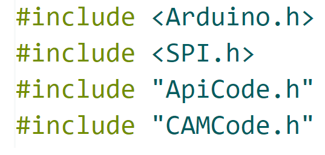

- Before resetting the FPAA and sending the primary configuration, call the an_InitializeApexReconfigData function.

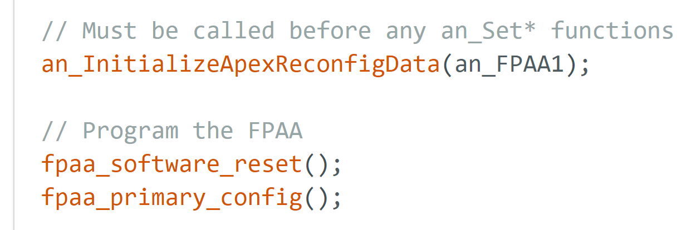

!!! note
	In case you are wondering where the an_FPAA1 variable is declared, that is a macro under the ApiCode.h file
	
	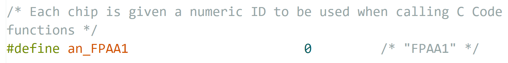

- The last step is to update the SPI transfer functions to read data from the API and forward it to the FPAA. Below is an example using the fpaa_software_reset function.

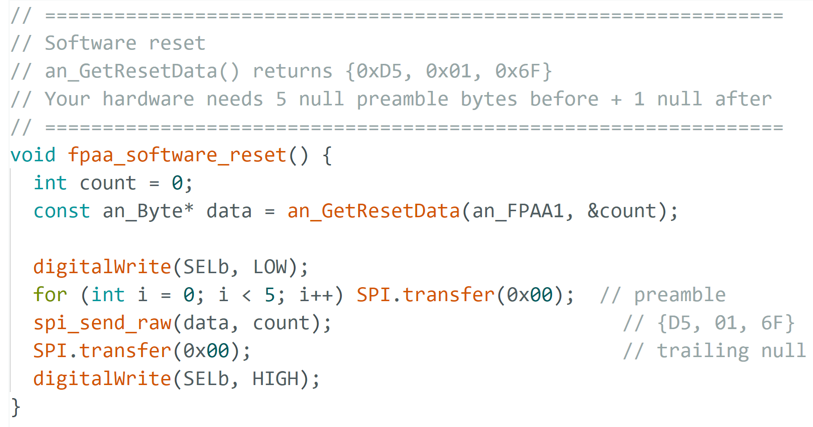

!!! note
	Remember to always prepend 5 null bytes and append 1 trailing null byte to every SPI transmission when using this method.

- You can now call the CAM functions to control the FPAA parameters. The main code for this example is shown below:

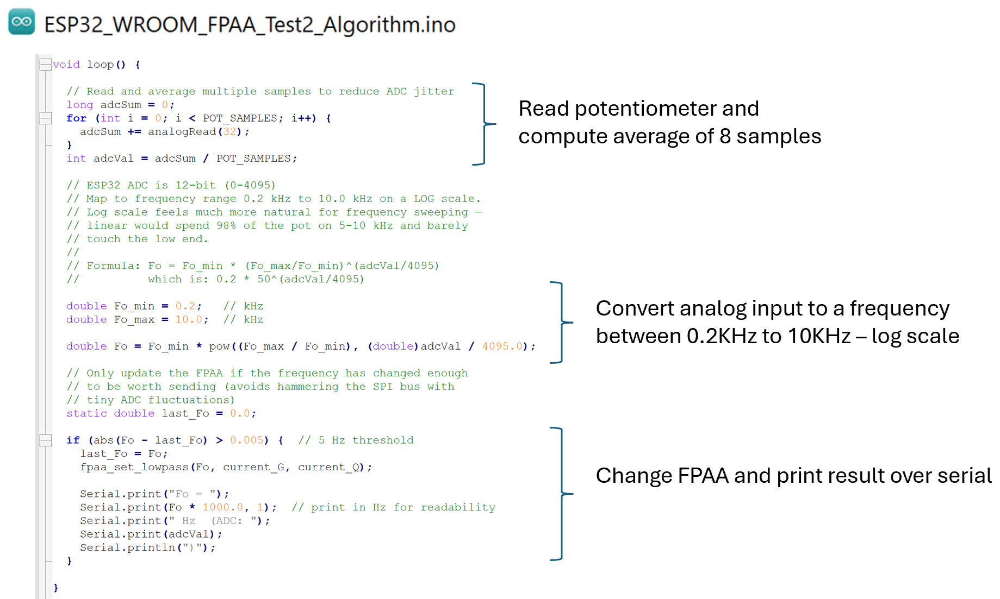

- Download the firmware code (available under the GitHub Repository section) on the ESP32.
- Compile and upload the code into the ESP32.

!!! note
	The firmware performs a software reset and then sends the primary configuration data over SPI. Since the ESP32 is not connected to the PORb pin, a software reset is used instead of a hardware reset — both produce the same result in this case.

The result on the oscilloscope is the following:

- Orange Line: generated waveform (signal in)
- Blue Line: output waveform from the FPAA (signal out)
- As the potentiometer is adjusted, the cut-off frequency changes accordingly, reducing the amplitude of the output waveform. Working as expected.

## **OTC231 Example**

The OTC231 is an Arduino shield that connects directly on top of an Arduino Uno and features one AN231 FPAA. It includes built-in logic level shifters, an onboard 16MHz clock, Rauch filters for single-ended to differential signal conversion, difference amplifiers for differential to single-ended signal conversion, and footprints for SMA connectors or 3.5mm audio jacks.

!!! warning
	The OTC2312 is designed specifically for the Arduino Uno. Do not use it with other Arduino boards unless you are confident they share the same GPIO logic levels.

- The complete test setup is below.

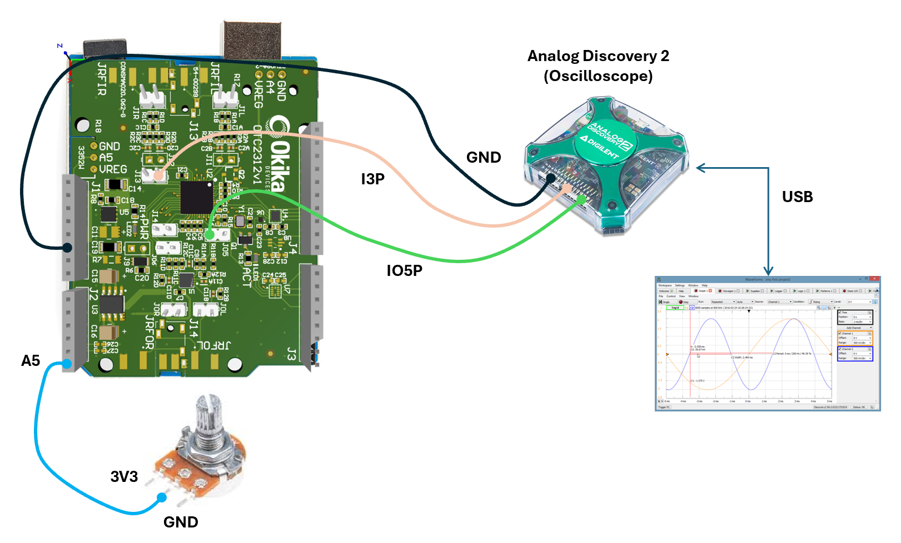

For simplicity I am going to use the same code as in the previous section.

- Download the firmware code (available under the GitHub Repository section).
- Compile and upload the code into the Arduino Uno.

The result on the oscilloscope is the following:

- Orange Line: generated waveform (signal in)
- Blue Line: output waveform from the FPAA (signal out)
- As the potentiometer is adjusted, the cut-off frequency changes accordingly, reducing the amplitude of the output waveform. Working as expected.

That is all for this article. Have fun 😊

## **GitHub Repository**

- Firmware code for [ESP32 Algorithm Example](https://github.com/gfm16617/EngrEDU_Website/blob/main/Okika/Firmware_Code/ESP32_WROOM_FPAA_Test2_Algorithm.zip)
- Firmware code for [OTC231 Algorithm Example](https://github.com/gfm16617/EngrEDU_Website/blob/main/Okika/Firmware_Code/OTC231_FPAA_Algorithm.zip)

## **References**

- [Why Use C Code?](https://help.okikadevices.com/index.html?page=html%2Fad203hf8.htm) - AnadigmDesign2 Help

